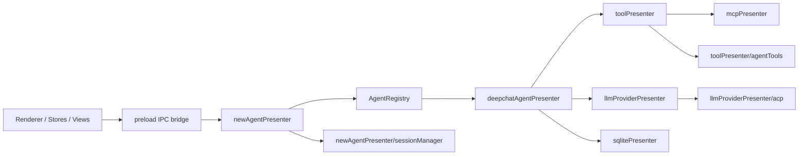
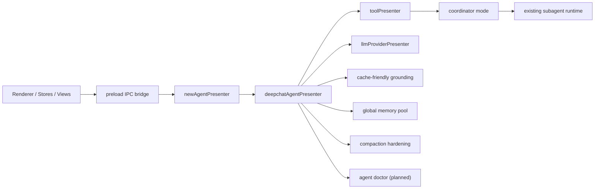

# DeepChat 当前架构概览

本文档描述 `2026-03-23` 完成 legacy `AgentPresenter` retirement 后的主架构。

## 主链路

主结论：

- `newAgentPresenter` 是 renderer 唯一会话入口。
- `deepchatAgentPresenter` 持有聊天 runtime、流式执行、工具交互、暂停恢复。
- `toolPresenter` 统一路由 MCP tools 与本地 agent tools。
- `llmProviderPresenter` 统一管理 provider 实例、流状态和 ACP provider helper。

## 模块职责

| 模块 | 位置 | 职责 |
| --- | --- | --- |
| `Presenter` 组装层 | `src/main/presenter/index.ts` | 组装 presenter 依赖，暴露主进程能力 |
| `NewAgentPresenter` | `src/main/presenter/newAgentPresenter/` | 会话创建、窗口绑定、agent 注册、IPC-facing API |
| `DeepChatAgentPresenter` | `src/main/presenter/deepchatAgentPresenter/` | 聊天 runtime、stream loop、tool interaction、message persistence |
| `ToolPresenter` | `src/main/presenter/toolPresenter/` | 工具定义聚合、调用路由、权限预检查 |
| `Agent tools` | `src/main/presenter/toolPresenter/agentTools/` | 文件系统、命令、settings 等本地工具 |
| `LLMProviderPresenter` | `src/main/presenter/llmProviderPresenter/` | provider 实例、stream state、model 管理、embedding、ACP provider |
| `ACP helpers` | `src/main/presenter/llmProviderPresenter/acp/` | ACP process/session/persistence/config/mcp 映射 |
| `SessionPresenter` | `src/main/presenter/sessionPresenter/` | legacy 会话数据访问、导出、thread list 广播、清理挂钩 |

## 当前分层

### 1. IPC / Session orchestration

`newAgentPresenter` 负责：

- 创建/删除/激活会话
- 绑定 `webContentsId -> sessionId`
- 维护 `AgentRegistry`
- 将请求路由到具体 agent implementation
- 持有 `LegacyChatImportService`

### 2. Chat runtime

`deepchatAgentPresenter` 负责：

- `processMessage()` 和 `processStream()` 主循环
- `sessionStore` / `messageStore` / `pendingInputStore`
- 工具暂停、权限响应、继续生成
- token context 构建、summary compaction、实时 echo

### 3. Tool routing

`toolPresenter` 负责：

- 从 `mcpPresenter` 聚合 MCP tools
- 从 `toolPresenter/agentTools` 聚合本地 agent tools
- 用 `ToolMapper` 建立 tool name -> source 映射
- 在调用时自动路由，并支持权限预检查

### 4. Provider layer

`llmProviderPresenter` 负责：

- provider instance lifecycle
- active stream bookkeeping
- model/embedding/rate limit 管理
- ACP session persistence 与 workdir/config helper

## 兼容边界

这次 retirement 后仍然保留的 legacy 边界只有：

- `src/main/presenter/newAgentPresenter/legacyImportService.ts`
- legacy import hook / status tracking
- 旧 `conversations/messages` 表，作为 import-only 与导出数据源
- `SessionPresenter` 作为 main 内部数据平面，不再是 renderer 主聊天入口

明确不再存在的职责：

- 旧 `AgentPresenter -> SessionManager -> startStreamCompletion()` runtime 链路
- renderer 对 `agentPresenter` / `sessionPresenter` 的公开依赖
- `ILlmProviderPresenter.startStreamCompletion()` 旧 loop 壳

## 归档与防回归

- 退休代码已归档到 `archives/code/legacy-agentpresenter-retirement/`
- 历史架构文档见 [archives/legacy-agentpresenter-architecture.md](./archives/legacy-agentpresenter-architecture.md)
- 历史流程文档见 [archives/legacy-agentpresenter-flows.md](./archives/legacy-agentpresenter-flows.md)
- 防回归脚本：`scripts/agent-cleanup-guard.mjs`

## 规划中的可靠性增强（Spec Only）

以下内容是已落库的规划文档，不代表当前已经全部实现：

规划重点：

- `agent-context-grounding`
  - 让稳定上下文在第一轮就进入 prompt，减少盲搜和错误假设。
- `permission-approval-productization`
  - 把当前权限机制补成完整的 remember / revoke / scope 产品闭环。
- `builtin-agent-presets` + `coordinator-mode`
  - 用 builtin preset 固定高频任务策略，并在现有 subagent 之上增加 coordinator 层。
- `global-memory-pool`
  - 用 DeepChat 数据池中的 DuckDB 建立唯一长期记忆载体，由 autonomy 自动提取、合并、遗忘。
- `compaction-hardening`
  - 强化现有 full compaction，并增加 micro-compaction 削减旧 tool 噪音。
- `agent-doctor`
  - 作为独立流补统一诊断与恢复。

相关规划入口：

1. [specs/agent-reliability-roadmap/spec.md](./specs/agent-reliability-roadmap/spec.md)
2. [specs/agent-reliability-roadmap/plan.md](./specs/agent-reliability-roadmap/plan.md)
3. [specs/coordinator-mode/spec.md](./specs/coordinator-mode/spec.md)
4. [specs/global-memory-pool/spec.md](./specs/global-memory-pool/spec.md)
5. [specs/compaction-hardening/spec.md](./specs/compaction-hardening/spec.md)

## 推荐阅读顺序

1. [FLOWS.md](./FLOWS.md)
2. [architecture/agent-system.md](./architecture/agent-system.md)
3. [architecture/tool-system.md](./architecture/tool-system.md)
4. [architecture/session-management.md](./architecture/session-management.md)
