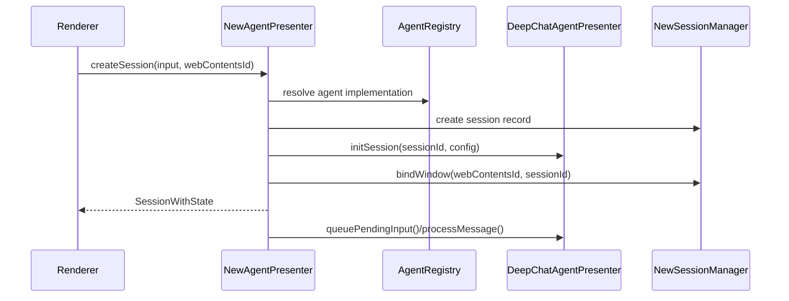
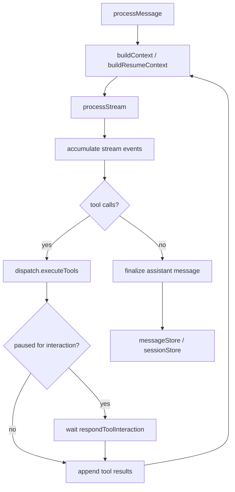
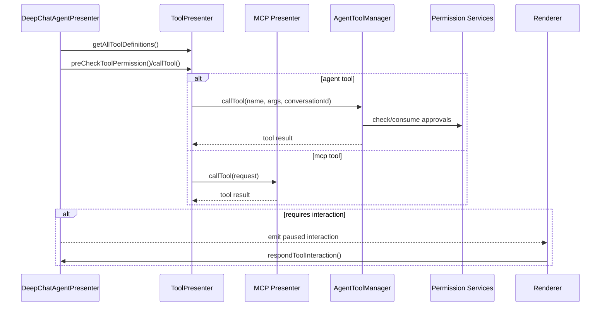
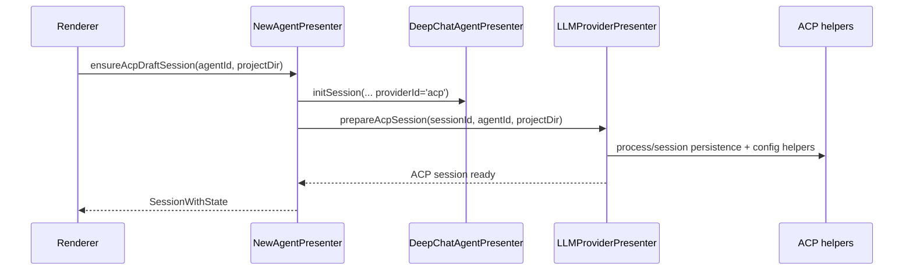
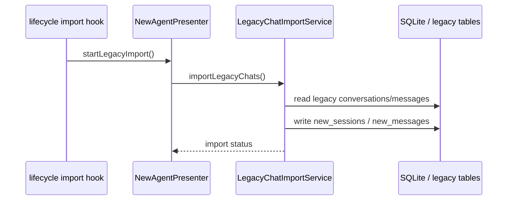
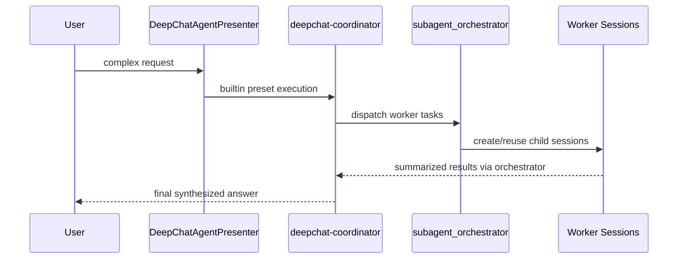
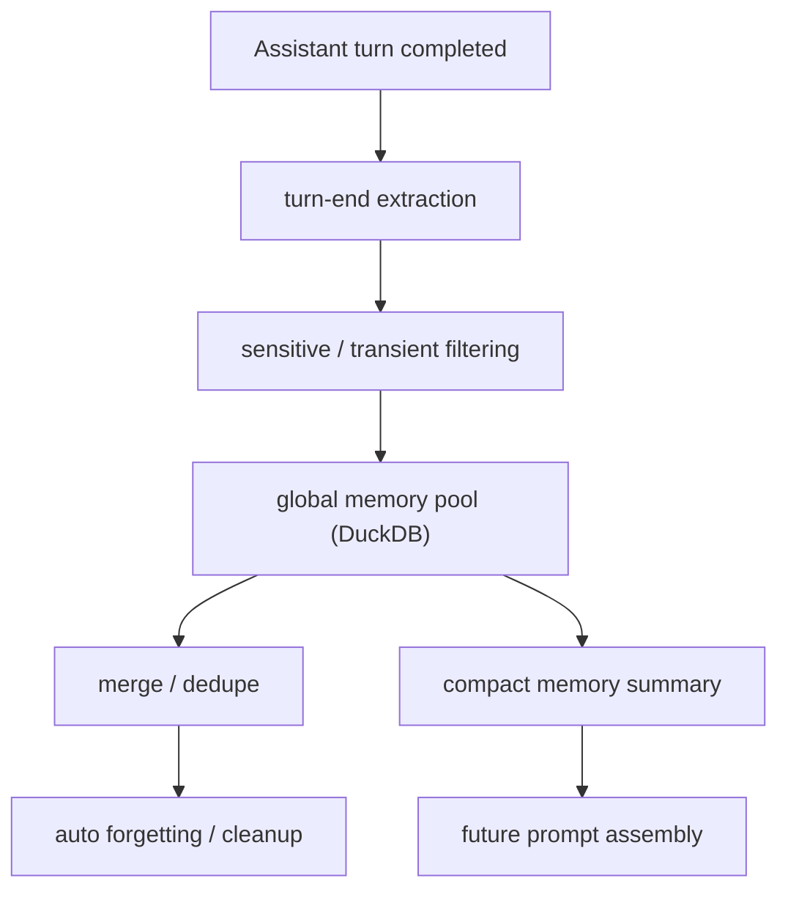
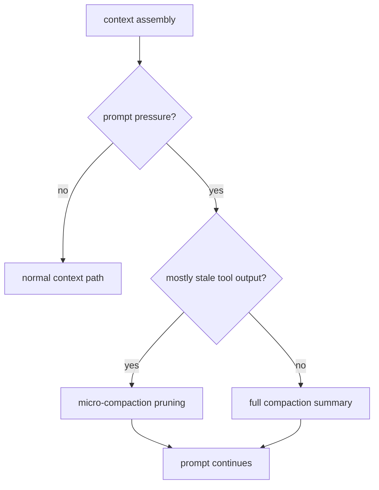

# DeepChat 当前核心流程

本文档只描述 retirement 后仍然有效的主流程。旧 `AgentPresenter` 流程已移到
[archives/legacy-agentpresenter-flows.md](./archives/legacy-agentpresenter-flows.md)。

## 1. 创建会话并发送消息

关键文件：

- `src/main/presenter/newAgentPresenter/index.ts`
- `src/main/presenter/newAgentPresenter/sessionManager.ts`
- `src/main/presenter/deepchatAgentPresenter/index.ts`

## 2. DeepChat 消息处理主循环

关键文件：

- `src/main/presenter/deepchatAgentPresenter/process.ts`
- `src/main/presenter/deepchatAgentPresenter/dispatch.ts`
- `src/main/presenter/deepchatAgentPresenter/contextBuilder.ts`
- `src/main/presenter/deepchatAgentPresenter/messageStore.ts`

## 3. 工具调用与权限

关键文件：

- `src/main/presenter/toolPresenter/index.ts`
- `src/main/presenter/toolPresenter/agentTools/agentToolManager.ts`
- `src/main/presenter/toolPresenter/agentTools/agentFileSystemHandler.ts`
- `src/main/presenter/mcpPresenter/toolManager.ts`

## 4. ACP draft session / runtime preparation

关键文件：

- `src/main/presenter/newAgentPresenter/index.ts`
- `src/main/presenter/llmProviderPresenter/index.ts`
- `src/main/presenter/llmProviderPresenter/acp/`

## 5. Legacy 数据导入

这个流程仍然保留，但只负责历史数据迁移，不再恢复旧 runtime。

关键文件：

- `src/main/presenter/newAgentPresenter/legacyImportService.ts`
- `src/main/presenter/lifecyclePresenter/hooks/after-start/legacyImportHook.ts`

## 6. 规划中的可靠性增强流程（Spec Only）

以下流程是当前已经落库的规划，不代表仓库当前已全部实现。

### 6.1 Coordinator mode on top of subagents

### 6.2 Global memory autonomy flow

### 6.3 Compaction hardening flow

相关规划文档：

1. [specs/coordinator-mode/spec.md](./specs/coordinator-mode/spec.md)
2. [specs/global-memory-pool/spec.md](./specs/global-memory-pool/spec.md)
3. [specs/compaction-hardening/spec.md](./specs/compaction-hardening/spec.md)
4. [specs/agent-reliability-roadmap/spec.md](./specs/agent-reliability-roadmap/spec.md)
