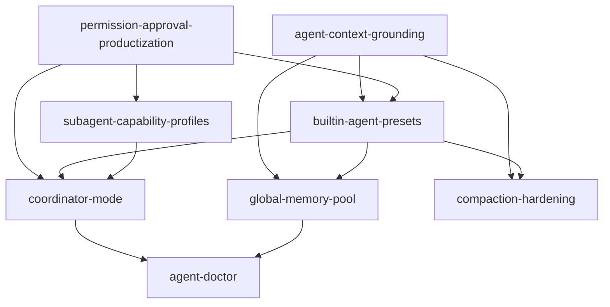

# Agent Reliability Roadmap 计划

## 关键决策

1. 用一份总路线图串联 8 个单项 spec，但不覆盖它们各自的实现细节。
2. 按“先稳定主链路，再增强多 agent 与高频工作流，再补长期记忆与 compaction，最后做统一诊断”的顺序推进。
3. 优先实施能直接降低误判、误写、误审批的能力。
4. coordinator 作为现有 subagent 架构的上层增强，不引入第二套 worker runtime。
5. 全局 memory pool 默认由 autonomy 驱动，但只能写 DeepChat 管理的数据池，不写业务代码。

## 推荐实施顺序

### Phase 1: Grounding + Permission

1. `agent-context-grounding`
2. `permission-approval-productization`

原因：

1. 这两项直接决定 agent “第一步是否看对、能不能稳地动手”。
2. 它们属于低耦合、高收益、风险下降最明显的基础设施。
3. 后续 builtin preset、coordinator、memory 和 compaction 都会受益于更稳定的上下文与审批机制。

### Phase 2: Presets + Coordinator + Capability Profiles

1. `builtin-agent-presets`
2. `coordinator-mode`
3. `subagent-capability-profiles`

原因：

1. grounding 与 permission 稳定后，高频工作流和多 agent 协作才能真正可预测。
2. preset 固定任务策略，coordinator 固定拆解与汇总语义，profile 固定 worker 能力边界。

### Phase 3: Global Memory + Compaction

1. `global-memory-pool`
2. `compaction-hardening`

原因：

1. 前两阶段先把即时行为稳定下来，再引入长期记忆和更强的上下文压缩，能降低错误记忆和劣质摘要带来的连锁问题。
2. 这两项会直接提升长任务、跨天任务和 tool-heavy 会话的连续性。

### Phase 4: Agent Doctor

1. `agent-doctor`

原因：

1. doctor 是高价值能力，但不是主链路可用性的前置条件。
2. 等前面能力稳定后再做 doctor，更容易定义真实检查项与恢复动作。

## 依赖关系图



## 里程碑

| 里程碑 | 包含内容 | 用户可感知变化 | 主要风险下降 |
| --- | --- | --- | --- |
| M1 | grounding + permission | 首轮更准，审批更少更清楚 | 误搜、误执行、审批疲劳 |
| M2 | presets + coordinator + profiles | review / architect / complex task delegation 更稳 | prompt 漂移、worker 越权 |
| M3 | global memory + compaction | 长任务、跨天任务、tool-heavy 会话更连续 | 长期约束丢失、上下文失焦 |
| M4 | doctor | 故障更可定位，可恢复 | 黑盒排障、恢复失败无解释 |

## 实现前后流程差异

### Before

```text
User prompt
  |
  v
Model explores repo ad hoc
  |
  +--> asks for permission with minimal context
  |
  +--> may spawn child with broad capability
  |
  +--> repeats constraints in later sessions
  |
  +--> keeps too much stale tool noise in long chats
  |
  v
Output quality varies by prompt quality
```

### After

```text
User prompt
  |
  v
Stable grounding builder
  |
  v
Builtin preset or coordinator path
  |
  v
Permission productization
  |
  v
Worker profile enforcement
  |
  v
Global memory summary retrieval
  |
  v
Compaction hardening / micro-pruning
  |
  v
More stable and explainable output
```

## 概念界面规划

### Approval Overlay

```text
+------------------------------------------------------------------+
| Permission Request                                               |
|------------------------------------------------------------------|
| Tool: exec                                                       |
| Risk: high                                                       |
| Reason: run formatter in project workspace                       |
| Scope: once | session | command prefix                           |
| Command: pnpm run format                                         |
| Path: C:\Users\zerob\Documents\deepchat                          |
|------------------------------------------------------------------|
| [Allow once] [Allow session] [Allow prefix] [Deny]               |
+------------------------------------------------------------------+
```

### Coordinator + Memory + Profiles 的协同关系

```text
+--------------------------------------------------------------------------------+
| Chat                                                                           |
|--------------------------------------------------------------------------------|
| Preset: deepchat-coordinator                                                   |
| Context: README summary | root AGENTS | memory summary                         |
|--------------------------------------------------------------------------------|
| Workers                                                                        |
| [read_only_scout] scan repo         -> completed                               |
| [reviewer] analyze risks            -> completed                               |
| [executor] patch only if needed     -> waiting permission                      |
|--------------------------------------------------------------------------------|
| Scratchpad: shared run notes                                                     |
| Final output: synthesized by coordinator                                       |
+--------------------------------------------------------------------------------+
```

### Autonomy Surface

```text
+--------------------------------------------------------------+
| Autonomy                                                     |
|--------------------------------------------------------------|
| Default: ON                                                  |
| Agent override: OFF for review preset                        |
| Session override: ON                                         |
|--------------------------------------------------------------|
| Recent memory changes                                        |
| - merged 2 duplicate constraints                             |
| - forgot 5 stale entries                                     |
| - kept 1 pinned rule                                         |
+--------------------------------------------------------------+
```

## 状态 / 数据模型

总路线图本身不定义新的 runtime 数据结构，但要求单项能力按以下分层落地：

1. Context layer
   - stable grounding summary
   - volatile on-demand context
   - nested instruction index
2. Policy / orchestration layer
   - permission approval scope
   - builtin preset tool policy
   - subagent capability profile
   - coordinator run metadata
3. Memory / autonomy layer
   - global memory entries
   - mixed retrieval summary
   - autonomy extraction / merge / forget events
4. Compaction layer
   - persisted full summary
   - prompt-time micro-compaction
5. Diagnostics layer
   - doctor check results
   - recovery action descriptors

## Main / Shared / Renderer 影响矩阵

| 能力 | Main | Shared | Renderer |
| --- | --- | --- | --- |
| Grounding | `systemEnvPromptBuilder`、context builder、repo scanner | grounding summary / index types | 可选上下文展示或 debug surfacing |
| Permission | permission services、ToolPresenter、session pause/resume bridge | approval payload / scope types | overlay、approval manager |
| Builtin Presets | agent repository、builtin config assembly | preset id / policy types | agent selection / session creation affordance |
| Coordinator | preset assembly、scratchpad service、subagent orchestration metadata | coordinator run / scratchpad types | 会话标签与复用现有 subagent 展示 |
| Subagent Profiles | subagent orchestrator、tool filtering、child session creation | profile enum / slot types | slot editor、child status display |
| Global Memory | autonomy hook、memory presenter、DuckDB-backed store | memory entry / summary / audit types | 轻量 memory / autonomy 管理面 |
| Compaction | `CompactionService`、context pruning、tool-output selection | compaction mode types | 复用现有 full compaction UI |
| Doctor | diagnostics presenter、probe runner、recovery dispatcher | check result / action types | doctor surface、status cards、recovery actions |

## 接口类型

总路线图要求以下类型面在单项实现中保持清晰、可审计：

1. Grounding
   - `ContextGroundingSummary`
   - `InstructionIndexEntry`
   - `VolatileContextSection`
2. Permission
   - `ToolInteractionResponse.remember`
   - `ToolInteractionResponse.approvalScope`
   - `PermissionApprovalRecord`
3. Presets / Coordinator
   - `builtinPresetId`
   - `BuiltinAgentPolicy`
   - `CoordinatorRunMeta`
   - `CoordinatorScratchpadEntry`
4. Subagent Profiles
   - `DeepChatSubagentSlot.capabilityProfile`
   - `SubagentCapabilityProfile`
5. Global Memory
   - `GlobalMemoryEntry`
   - `GlobalMemoryCandidate`
   - `GlobalMemorySummary`
   - `MemoryAutonomyEvent`
6. Compaction
   - `compactionMode: 'full' | 'micro'`
7. Doctor
   - `DoctorCheckResult`
   - `DoctorRecoveryAction`

## 测试计划

### 文档层

1. 所有链接都能跳到对应单项 spec。
2. 路线图中的 phase 顺序与各单项 spec 的默认决策不冲突。
3. 视觉示意与单项能力边界一致，不引入未定义产品行为。

### 实现层 gating

每个里程碑进入开发前都应满足：

1. 单项 spec / plan 已完成 review。
2. 依赖前置项至少达到 implementation-ready。
3. 风险与迁移策略已写入对应 plan。

每个里程碑完成后都应验证：

1. `pnpm run format`
2. `pnpm run i18n`
3. `pnpm run lint`
4. 关键主链路测试与新增测试通过

## 风险缓解

1. 避免大一统改造：每项能力单独起 spec / plan / implementation stream。
2. 避免缓存退化：grounding 默认只注入稳定层，volatile 信息按需获取。
3. 避免权限系统分叉：approval productization 只扩展现有 permission service / cache。
4. 避免 coordinator 变成第二套 runtime：复用现有 `subagent_orchestrator` 和 child session。
5. 避免 memory 污染 prompt：只做结构化筛选 + 语义重排后的 compact summary。
6. 避免 compaction 变成第二聊天系统：micro-compaction 只做 prompt-time pruning。
7. 避免 doctor 需求发散：先做 checks + recovery，再考虑更大产品面。

## 默认执行策略

1. 总路线图文档始终作为“排期与目标对齐”入口，不代替单项 spec。
2. 后续若新增新的 reliability 能力，应先判断是否属于本路线图，再决定是否补充这里的 phase 图。
3. 当单项 spec 发生方向变化时，应同步更新这里的依赖图、里程碑与体验差异描述。
