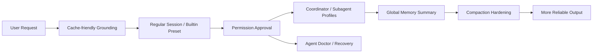

# Agent Reliability Roadmap 规格

## 背景问题

DeepChat 当前已经有一条很强的 agent 主链路：真实 child session subagent、trace 独立落库、tool interaction overlay、自动 compaction、background exec、skill 体系都已经具备。但从“更可靠、更好用、更可解释”的角度看，还缺几块关键拼图：

1. 首轮 grounding 仍不够稳，容易盲搜或错误假设仓库结构。
2. permission 后端能力已经有基础，但记忆 scope、撤销、风险解释还不完整。
3. 高频工作流主要靠用户手写 prompt，一致性不够。
4. subagent 能跑，但缺少稳定的 coordinator 层和更细的 worker 能力边界。
5. 长期记忆仍偏依赖上下文和重复提醒，没有统一的全局 memory pool。
6. compaction 已有，但在长任务和 tool-heavy 场景下，摘要质量和轻量清理能力还有提升空间。
7. 故障理解与恢复仍偏黑盒，doctor 还未产品化。

这些缺口会带来三个直接问题：

1. 同样的需求在不同会话里结果波动更大。
2. 用户要花更多精力做 prompt、审批和重复纠偏。
3. 多 agent 和长任务会逐步暴露安全性、连续性和可解释性的短板。

## 目标

本路线图定义一组相互配合的 reliability-oriented 规格，使 DeepChat 在不重写现有 runtime 的前提下，逐步具备更强的：

1. Grounding stability
2. Permission explainability
3. Workflow consistency
4. Multi-agent orchestration safety
5. Long-term memory continuity
6. Compaction resilience
7. Runtime diagnosability

## 非目标

1. 不重写 `newAgentPresenter -> deepchatAgentPresenter -> ToolPresenter` 主链路。
2. 不照搬 Claude Code 的 terminal-first 单体交互形态。
3. 不做 `MEMORY.md`、`Magic Docs`、`Team Memory Sync` 这类多套记忆系统。
4. 不让后台自动化修改业务代码。
5. 不要求 `agent-doctor` 和其他能力在同一版本同时实现。

## 实现后会带来的不同

### Before vs After

| 维度 | Before | After |
| --- | --- | --- |
| 首轮理解项目 | 模型更依赖临时搜索和用户补充 | 会话自带稳定 grounding，首轮更快进入正确目录与规则 |
| 权限审批 | 以“当次是否允许”为主，记忆与撤销弱 | scope、remember、revoke 完整，审批更少、更稳 |
| 常见工作流 | 用户自己拼 prompt | builtin preset 收口高频任务，输出结构更稳定 |
| 多 agent 编排 | 主要依赖直接 subagent 调度 | 有 coordinator 层统一拆解、复用 worker、汇总结果 |
| 长期记忆 | 主要靠上下文和重复提醒 | 全局 memory pool 按 project/time 组织并自动维护 |
| 长会话压缩 | 已有 full compaction，但 tool-heavy 时易噪音过多 | full compaction 更稳，且有 micro-compaction 削减旧工具噪音 |
| 故障理解 | 依赖 trace 和经验排查 | doctor 提供可解释状态与恢复路径 |

### 用户体验上的直接收益

1. 首轮更少盲搜，进入正确工作目录更快。
2. 高频任务更少 prompt 体操。
3. tool approval 次数减少，且每次批准都更可解释。
4. 多 agent 任务拆解、worker 复用和结果汇总更稳定。
5. 跨天任务和跨 session 任务更容易延续。
6. 长对话不容易因为旧 tool 输出噪音而“失焦”。

### 风险下降点

1. 降低错误修改风险：靠 grounding、coordinator、profile 和 permission scope 联动减少误操作。
2. 降低 prompt 漂移风险：靠 builtin preset 和 compaction hardening 固定高频任务策略与上下文质量。
3. 降低重复审批疲劳：靠 remember scope 与 approval manager。
4. 降低长期记忆污染：靠全局 memory pool 的结构化筛选、自动合并、自动遗忘。
5. 降低排障成本：doctor 将“agent 不稳定”拆成可定位的检查项。

## 整体概念图



## 整体界面示意

### Chat Surface

```text
BEFORE
+-----------------------------------------------------------+
| Chat                                                      |
|                                                           |
| User: review and refactor this repo                       |
| Assistant: starts searching around with limited context   |
|                                                           |
| Permission popup:                                         |
| [Allow] [Deny]                                            |
|                                                           |
| Child sessions: visible but mostly task-by-task           |
+-----------------------------------------------------------+

AFTER
+--------------------------------------------------------------------------------+
| Chat                                                                           |
| Context: README summary | Root AGENTS | Repo profile | Memory summary          |
|--------------------------------------------------------------------------------|
| User: review and refactor this repo                                            |
| Assistant: chooses coordinator preset                                          |
|                                                                                |
| Permission Overlay                                                             |
| risk: medium   tool: exec   reason: run read-only repo check                   |
| scope: once | session | command prefix                                         |
| [Allow once] [Allow session] [Allow prefix] [Deny]                             |
|                                                                                |
| Coordinator Run                                                                |
| scout(read-only)   reviewer(read-only)   executor(write-enabled when needed)   |
| running            completed               waiting permission                    |
+--------------------------------------------------------------------------------+
```

### Autonomy / Memory Surface

```text
+----------------------------------------------------------------+
| Autonomy                                                       |
|----------------------------------------------------------------|
| Global default: ON                                             |
| Agent override: OFF for review preset                          |
| Session override: ON                                           |
|----------------------------------------------------------------|
| Recent memory changes                                          |
| - merged 2 duplicate repo constraints                          |
| - forgot 5 stale low-value entries                             |
| - kept 1 pinned build rule                                     |
+----------------------------------------------------------------+
```

## 关联规格

本路线图聚合以下规格：

1. [agent-context-grounding](../agent-context-grounding/spec.md)
2. [permission-approval-productization](../permission-approval-productization/spec.md)
3. [builtin-agent-presets](../builtin-agent-presets/spec.md)
4. [coordinator-mode](../coordinator-mode/spec.md)
5. [subagent-capability-profiles](../subagent-capability-profiles/spec.md)
6. [global-memory-pool](../global-memory-pool/spec.md)
7. [compaction-hardening](../compaction-hardening/spec.md)
8. [agent-doctor](../agent-doctor/spec.md)

## 验收标准

1. 路线图明确说明 8 个优化项分别解决什么问题、带来什么优势、降低什么风险。
2. 文档明确说明推荐实施顺序及其原因。
3. 文档包含至少 1 个整体流程图和 2 个 ASCII UI 概念示意。
4. 文档明确 `deepchat-coordinator` 不是第二套 runtime，`global-memory-pool` 是唯一长期记忆载体，`agent-doctor` 可延后实现。
5. 单独阅读本规格时，读者可以理解整个 reliability program 的目标图景。

## 约束

1. 缓存命中率是 grounding 设计的硬约束，`git status` 与目录树全文不得进入每轮常驻 system prompt。
2. 权限产品化必须复用现有 permission service / cache / pause-resume 语义，而不是重造系统。
3. builtin preset 和 coordinator mode 必须运行在现有 DeepChat agent runtime 内，不新增第二套 runtime。
4. subagent capability profile 必须在现有 child session 模型上增量扩展。
5. 全局 memory pool 必须使用 DeepChat 数据池，且不能自动修改业务代码。
6. compaction hardening 必须兼容现有 persisted summary 模型。
7. doctor 可以作为独立流实现，但最终需要与现有 trace / usage / health 视角协同。

## 兼容性 / 迁移

1. 现有 regular session、ACP session、remote session 的主链路不因本路线图直接改变。
2. 现有 agent 配置继续可用；新增能力应以默认兼容方式接入。
3. 现有没有 profile 的 subagent slot 默认视为 `executor`。
4. 现有没有 memory 数据的环境按空状态处理，不需要迁移阻塞。
5. `agent-doctor` 在未实现前，不影响现有 trace / overlay / settings 路径。

## 默认决策

1. 第一优先级是 `agent-context-grounding` 与 `permission-approval-productization`。
2. 第二优先级是 `builtin-agent-presets`、`coordinator-mode` 与 `subagent-capability-profiles`。
3. 第三优先级是 `global-memory-pool` 与 `compaction-hardening`。
4. `agent-doctor` 默认单独推进，不进入第一批实现。
5. 所有优化项都以“增强现有架构”为前提，不以“推倒重来”为目标。
